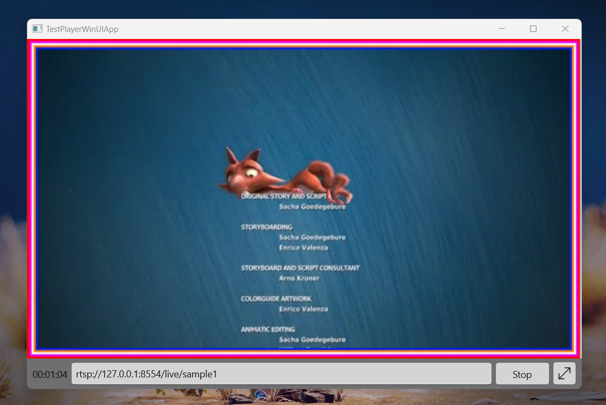

# TestPlayerWinUIApp using [Flyleaf](https://github.com/SuRGeoNix/Flyleaf)


### Push rtsp stream
```bash
ffmpeg.exe -re -stream_loop -1 -i sample_rb.mp4 -c:v copy -c:a copy -tune zerolatency -preset ultrafast -f rtsp rtsp://127.0.0.1:8554/live/sample1
```